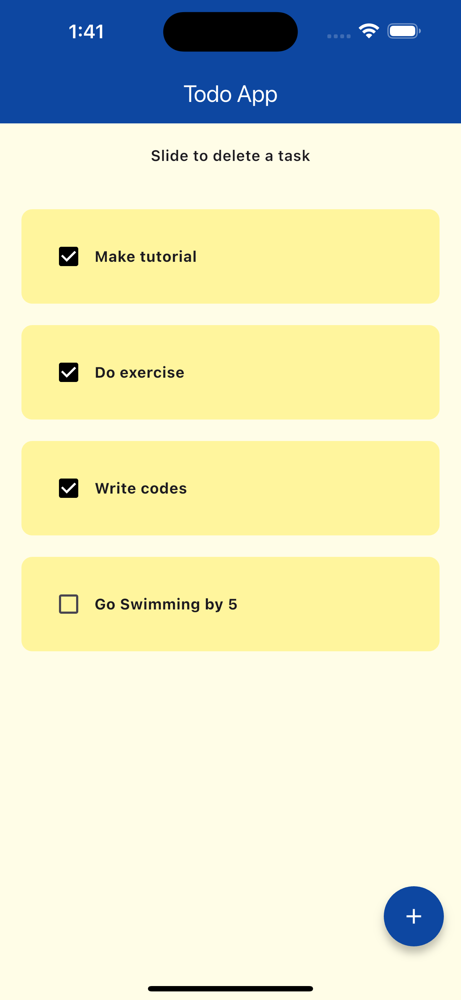

# Todo App

A simple Todo application built with Flutter.

## Features

- Add new tasks
- Mark tasks as completed
- Delete tasks
- Persistent storage using Hive

## Screenshot



## Getting Started

### Prerequisites

- Flutter SDK: [Install Flutter](https://flutter.dev/docs/get-started/install)
- Dart SDK: Comes with Flutter
- Hive: [Hive Documentation](https://docs.hivedb.dev/)

### Installation

1. Clone the repository:

   ```sh
   git clone https://github.com/abraham-alizor/todoapp.git
   cd todo_app
   ```

2. Install dependencies:

   ```sh
   flutter pub get
   ```

3. Run the app:
   ```sh
   flutter run
   ```

## Usage

- Tap the "+" button to add a new task.
- Enter the task name and save it.
- Swipe left on a task to delete it.
- Tap the checkbox to mark a task as completed.

## Dependencies

- `flutter`: ^2.0.0
- `cupertino_icons`: ^1.0.8
- `flutter_slidable`: ^3.1.2
- `hive`: ^2.0.5
- `hive_flutter`: ^1.1.0

### Dev Dependencies

- `flutter_test`: sdk: flutter
- `flutter_lints`: ^4.0.0
- `hive_generator`: ^1.1.0
- `build_runner`: ^2.1.7

## Contributing

1. Fork the repository
2. Create your feature branch (`git checkout -b feature/AmazingFeature`)
3. Commit your changes (`git commit -m 'Add some AmazingFeature'`)
4. Push to the branch (`git push origin feature/AmazingFeature`)
5. Open a pull request

## License

Distributed under the MIT License. See `LICENSE` for more information.

## Contact

Your Name - [abraham-alizor@gmail.com](mailto:abraham-alizor@gmail.com)

Project Link: [https://github.com/abraham-alizor/todoapp](https://github.com/abraham-alizor/todoapp)
